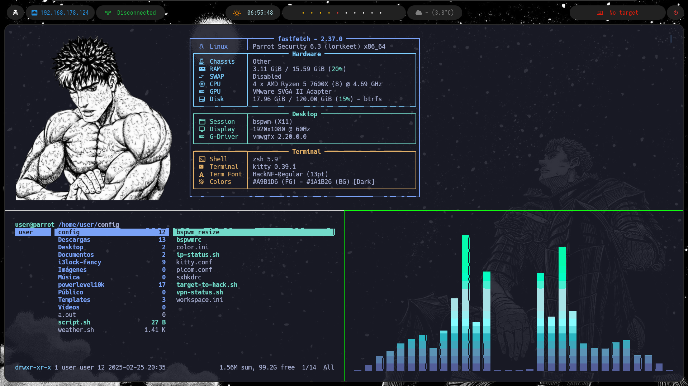

# auto-bspw
Toda mi configuracion de bspwm para tener un entorno profesional pensado para hacking en parrot OS con BSPWM. # Shotout to la comunidad de Hack4u

**1.** Actualizar Parrot OS
```
sudo apt update
sudo parrot-upgrade -y
```
**2.** Copiar el repositorio
```
git clone https://github.com/DkESP/auto-bspw/
cd auto-bspwm
```
**3.** Darle permisos de ejecucion al archivo
```
chmod +x install.sh
```
**5.** Una vez el script haya finalizado, se te dara la opcion de reiniciar el sistema(Todas las configuraciones se aplicaran una vez reinicies y cambies de entorno a BSPWM)

# Fotos

