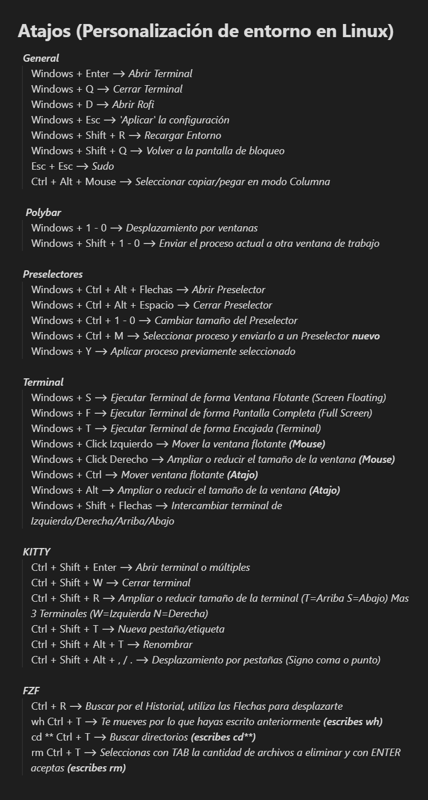

# auto-bspwm
Toda mi configuracion de bspwm para tener un entorno profesional pensado para hacking en parrot OS con BSPWM. # Shotout to la comunidad de Hack4u

**1.** Configurar Parrot OS base

descargar Parrot.
url: https://www.parrotsec.org/download/
```
al iniciar el parrot, instalalo con la configuarcion a tu gusto.(preferiblemente que el usuario se llame user)
```

actualizar parrot.
```
sudo apt update
sudo parrot-upgrade -y
```
**2.** Copiar el repositorio
```
git clone https://github.com/DkESP/auto-bspwm

cd auto-bspwm
```
**3.** Darle permisos de ejecucion al archivo
```
chmod +x install.sh
```
**5.** Una vez el script haya finalizado, se te dara la opcion de reiniciar el sistema(Todas las configuraciones se aplicaran una vez reinicies y cambies de entorno a BSPWM)

# ATENCION 
script probado en parrot(puedo suponer que en kali puede funcionar, pero no lo aseguro)
**IMPORTANTE**
revisar el archivo bspwm y .zshrc (pueden tener cadenas con usuarios erroneos, cambialo por tu usuario)
Atajos de teclado:


# Fotos

